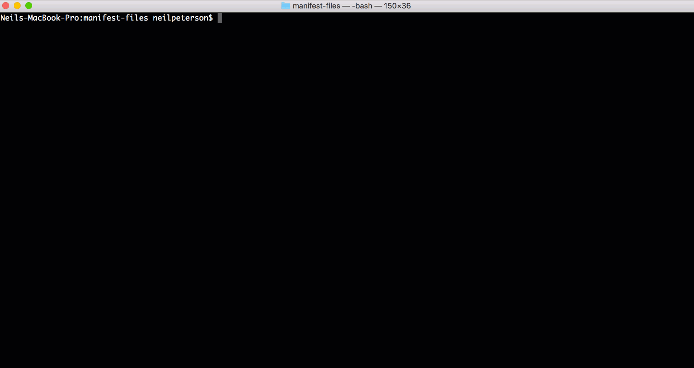

# Kubernetes burst scheduler

Simple scheduler that will burst workload to a named node after a specified number of related pods have been started.

Short two minute demo – this is also available on [youtube.com](https://youtu.be/ixuz_4F8SW0), which may be easier to view from the beginning, pause, etc. 



## Attribution

This is my first go project and first exposure to the Kubernetes go client. Throughout, these two resources have been invaluable. Many thanks to the contributing teams.

- [Joe Beda controller sample](https://github.com/jbeda/tgik-controller)
- [Tu Nguyen kubewatch example / blog](https://engineering.bitnami.com/articles/kubewatch-an-example-of-kubernetes-custom-controller.html)

## Starting the scheduler

The following manifest can be used to start the scheduler. Update `<node-name>` with the name of the burst node, and `<integer>` with the burst value. See the arguments section for details on all possible arguments.

```yaml
apiVersion: apps/v1beta1
kind: Deployment
metadata:
  name: burst-scheduler
spec:
  replicas: 1
  template:
    metadata:
      labels:
        app: burst-scheduler
    spec:
      containers:
      - name: kubectl-sidecar
        image: neilpeterson/kubectl-proxy-sidecar
      - name: burst-scheduler
        image: neilpeterson/burst-scheduler:v1
        args: ["--burstNode", "<node-name>", "--burstValue", "<integer>"]
```

The following arguments can be used when starting the scheduler.

| Argument | Type | Description |
|---|---|---|
| burstNode | String | Node name of the burst node. This is the node on which pods are scheduled once the burstValue has been met. |
| burstValue | Int | Value that controls how many pods will be scheduled on Kubernetes nodes vs. burst node. |
| namespace | String | Kubernetes namespace. |
| kubeConfig | Bool | Indicates that a kubernetes config file found at $KUBECONFIG is used for cluster discovery / auth. If not specified, it is assumed execution is occurring from a pod in the Kubernetes cluster. |
| schedulerName | String | The name of the scheduler, this will match the named scheduler when deploying pods. The default value os burst-scheduler. |

## Pod configuration

To manage burst scheduling across a set of related pods, two things need to be in place.

-	**Scheduler name** – when using a custom scheduler, the scheduler name must be specified in the pod manifest. In the following example, a name is `burst-scheduler`. This is the default name of the burst scheduler. This name is configurable when starting the scheduler, see the section on starting the scheduler.
-	**App label** – labels are used to group related pods for calculating weight and distribution. Currently the label must have a name of `app`. All pods that have this label will be grouped on the label value. In the following example the value of `aci-helloworld` is used to group and calculate pod placement. 


```yaml
apiVersion: apps/v1beta1
kind: Deployment
metadata:
  name: aci-helloworld
spec:
  replicas: 5
  template:
    metadata:
      labels:
        app: aci-helloworld
    spec:
      schedulerName: burst-scheduler
      containers:
      - name: aci-helloworld
        image: microsoft/aci-helloworld
        ports:
        - containerPort: 80
        resources:
          requests:
            memory: 1G
            cpu: 250m
```